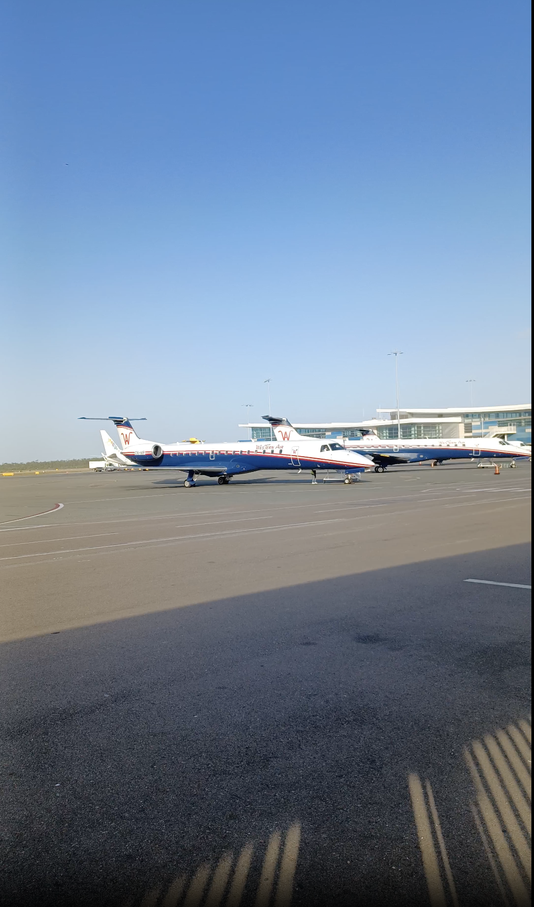
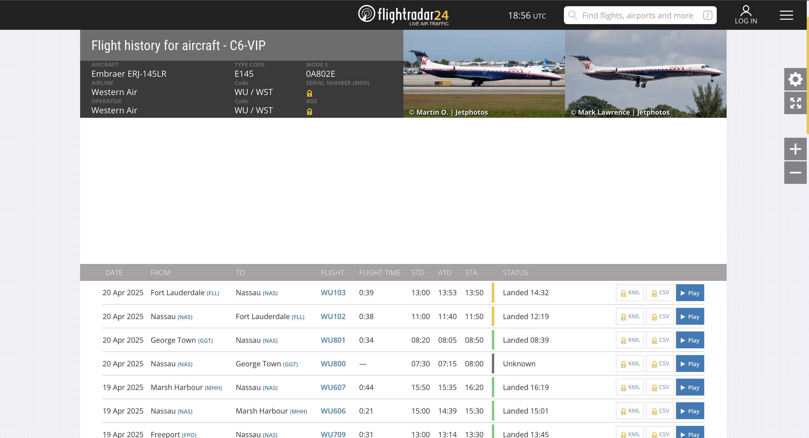

# ✈️ Aircraft Identification from Video Footage

## 🎯 Objective

Identify an aircraft based on video footage using open-source tools and publicly available flight tracking services. The investigation focused on the aircraft’s visible registration number.

---

## 🎥 Source Material

A short video clip published on [limitless-osint.com](https://limitless-osint.com/challenge-level9), showing a parked aircraft.  
The aircraft’s tail number is clearly visible: **C6-VIP**.

---

## 🛠 Methodology

1. **Video Frame Analysis**

   - Carefully inspected the video footage
   - Observed and confirmed the tail number

2. **Registration Lookup**

   - Identified the visible tail number: **C6-VIP**
   - Queried the registration using:
     - [FlightRadar24](https://flightradar24.com)

3. **Aircraft & Operator Identification**

   - Verified the aircraft type and ownership
   - Cross-referenced information using publicly available sources, including Wikipedia

4. **Location of the Recording**

   - Performed reverse image searches
   - Identified the location using Google Images
   - Verified possible points of interest and landmarks

5. **Time and Date of the Recording**
   - Extracted metadata from the video file using publicly available tools

---

## 📌 Results

- **Tail Number:** C6-VIP
- **Aircraft Type:** Embraer ERJ-145LR
- **Operator:** Western Air
- **Flight Activity:** Flight from Freeport Grand Bahama International Airport to Lynden Pindling International Airport
- **Location of Observation:** Lynden Pindling International Airport
- **Date of Observation:** 29.03.2025
- **Purpose:** Commercial passenger service

**Screenshots:**

- 
- 

---

## 🔗 Related Links

- [FlightRadar24 – C6-VIP](https://www.flightradar24.com/data/aircraft/c6-vip)
- [Video Source – Limitless OSINT Level 9](https://limitless-osint.com/challenge-level9)
