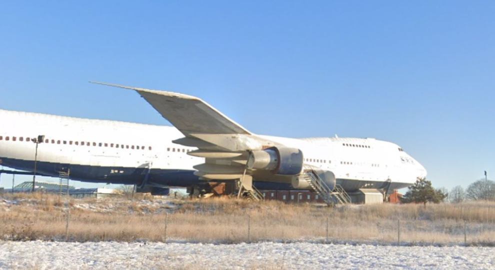
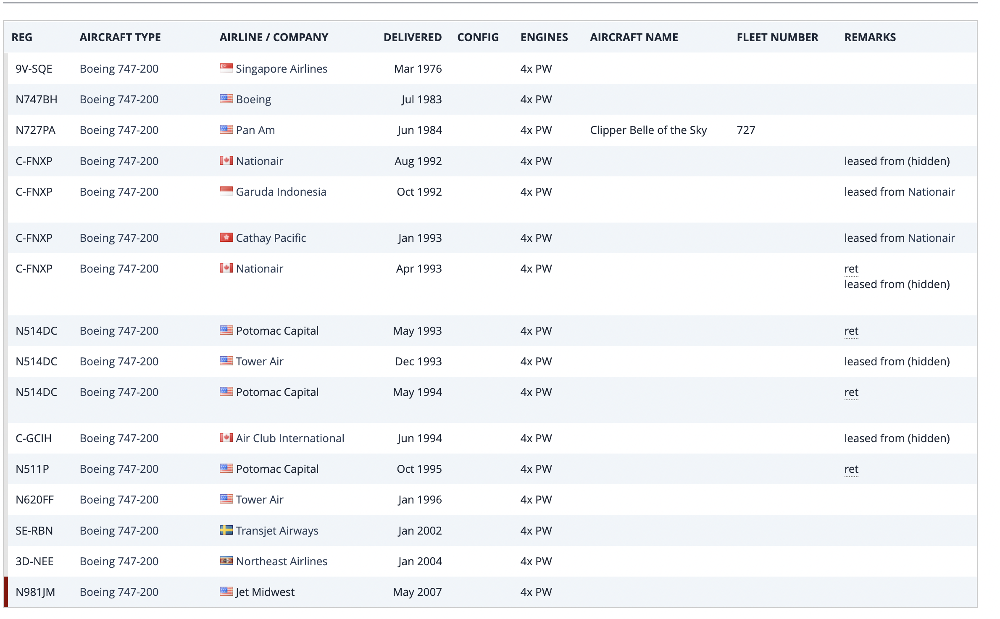

# ✈️ Aircraft History Investigation via OSINT

## 🎯 Objective

Identify a photographed aircraft and uncover its operational history using open-source tools and aviation databases.

---

## 📷 Source Material

A single image showing a parked aircraft, visually recognizable as a Boeing 747.  
Initial metadata and visual inspection indicated the aircraft had been repurposed and was no longer active.

---

## 🛠 Methodology

1. **Visual Identification**
   - Based on its shape and configuration, the aircraft was visually identified as a **Boeing 747**

2. **Metadata Analysis**
   - Used Metadata2Go to extract metadata from the image
   - Found possible timestamp in a **Scandinavian language**, hinting at a Nordic country origin

3. **Reverse Image Search**
   - Conducted a Google Images reverse search to locate similar photographs
   - Discovered the plane is currently a **decommissioned Boeing 747 converted into a hotel**
   - Location confirmed as **Stockholm Arlanda Airport (ESSA), Sweden**
   - Identified aircraft registration: **N981JM**

4. **Historical Data Lookup**
   - Queried [Planespotters.net](https://www.planespotters.net/) for registration **N981JM**
   - Investigated aircraft operational history and previous ownership records

---

## 📌 Results

- **Aircraft Type:** Boeing 747-200  
- **Current Use:** Converted into the Jumbo Stay hotel  
- **Location:** Stockholm Arlanda Airport (ESSA), Sweden  
- **Registration Number:** N981JM  
- **Historical Operator (April 1993):** Nationair Canada  
- **Status:** Retired from active service and repurposed as a static hotel facility

**Screenshots:**

-   
- 

---

## 🧠 Findings

- Combining visual aircraft recognition with historical registration databases enables a full trace of operational history
- Metadata hints (e.g., Scandinavian language timestamp) can provide regional clues even when GPS is unavailable
- Long-retired aircraft can still be accurately traced using resources such as Planespotters and JetPhotos

---

## 🔗 Related Links

- [Planespotters – N981JM](https://www.planespotters.net/)
- [Nationair Canada – Fleet History](https://en.wikipedia.org/wiki/Nationair)