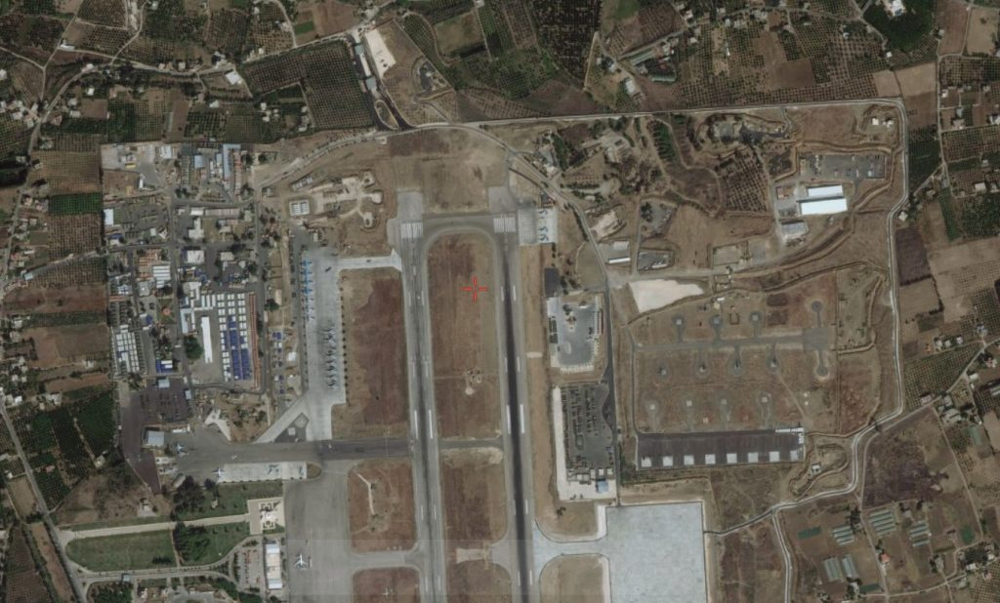

# 🛰️ Airbase Identification from Satellite Imagery

## 🎯 Objective

Identify the location of a military airbase based on satellite imagery using open-source intelligence methods, including reverse image search and geospatial analysis.

This challenge comes from the hacktoria.com

---

## 🛰️ Source Material

A satellite image depicting an airbase with visible runways, aircraft, and surrounding infrastructure.  
The image was provided as part of the Limitless OSINT challenge.

---

## 🛠 Methodology

1. **Metadata Analysis**
   - Extracted metadata from the image file using public tools  
   - Found no embedded geolocation or device data (metadata fields were empty)

2. **Reverse Image Search**
   - Uploaded the satellite image to Google Images  
   - Found multiple matches identifying the location as **Khmeimim Air Base**, Syria

3. **Geospatial Verification**
   - Compared the original image with satellite imagery on Google Maps  
   - Verified the match based on:
     - Runway orientation
     - Layout of hangars, taxiways, and aircraft parking areas
     - Surrounding structures and landscape

---

## 📌 Results

- **Identified Location:** Khmeimim Air Base, Syria  
- **Coordinates:** Approximately 35.4014° N, 35.9486° E  
- **Region:** Latakia Governorate, Syria  
- **Primary Use:** Military operations (primarily Russian Air Force and Syrian Arab Air Force)

**Screenshots:**

-   

---

## 🧠 Findings

- Despite missing metadata, reverse image search enabled rapid identification
- Geospatial features (runways, buildings, patterns) provided strong confirmation
- OSINT methods can successfully validate military site locations using only visual data

---

## 🔗 Related Links

- [Google Maps – Khmeimim Air Base](https://www.google.com/maps/place/35%C2%B024'05.0%22N+35%C2%B056'55.0%22E/)  
- [Article about Khmeimim Air Base (Wikipedia)](https://en.wikipedia.org/wiki/Khmeimim_Air_Base)

