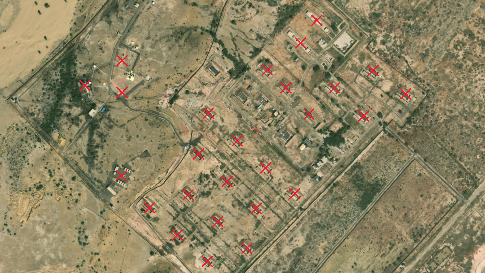
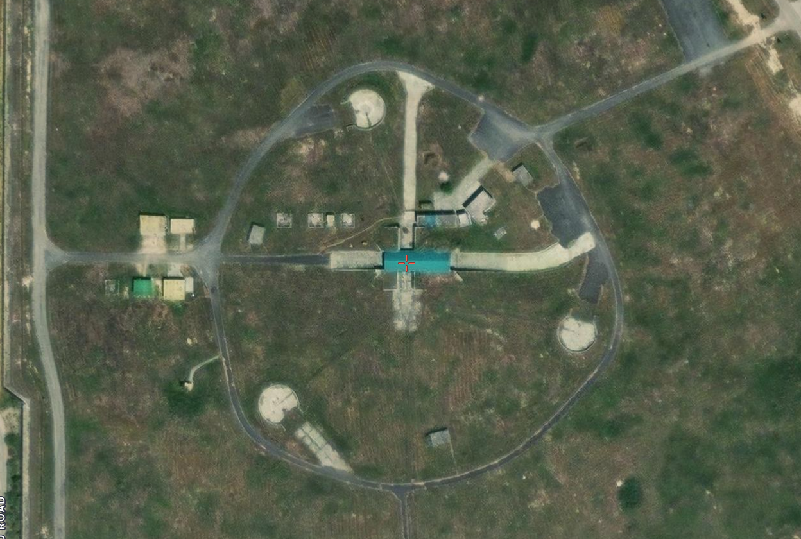
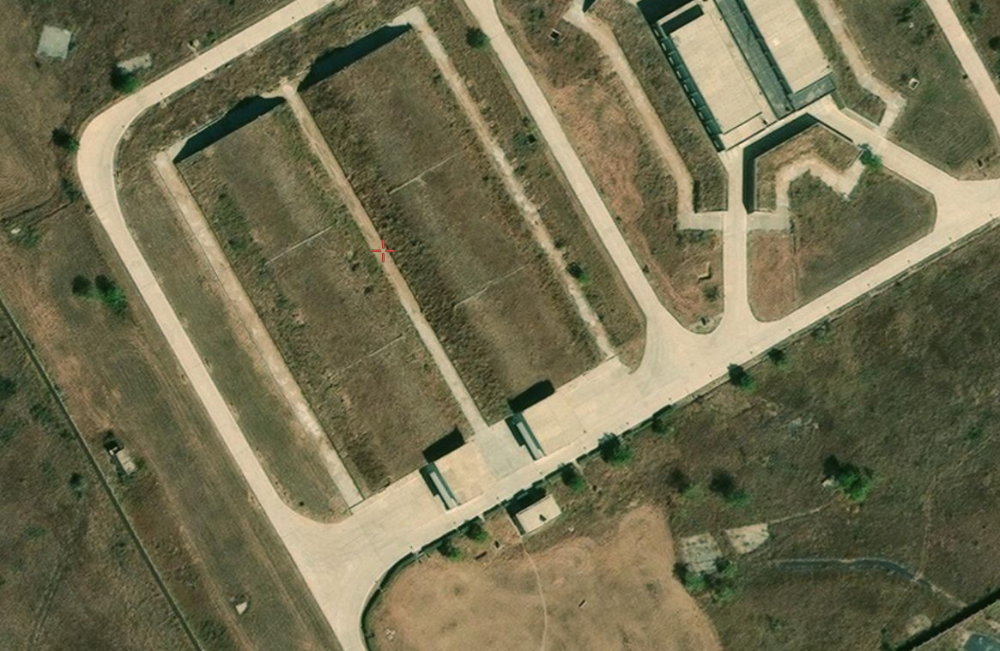

# 🛰️ Identifying Airbases from Fragmented Satellite Imagery – Indo-Pak Border

## 🎯 Objective

Analyze a set of fragmented satellite images to identify potential airbase locations across the India–Pakistan border using open-source intelligence techniques.
This challenge scenario involves parsing incomplete geospatial data in a high-tension region.

This challenge comes from the hacktoria.com

---

## 📷 Source Material

Received a ZIP archive containing multiple PDF files with military information, including partial satellite imagery and photographs of aircraft and infrastructure.

---

## 🛠 Methodology

1. **Security Inspection**
  - Scanned the ZIP archive using VirusTotal
  - Result: No malware detected

2. **Metadata Extraction**
  - Used exiftool to inspect ZIP and image metadata
  - Found revealing file path: "Additional Intel/"
  - Some images contained no usable EXIF data

3. **Content Review**
  - Extracted data included:
  - Operational orders (in Urdu)
  - Satellite fragments of three possible targets
  - Images of military aircraft and ground structures
  - Various inforamtion on Indian Air Force

4. **Translation & Contextual Analysis**
  - Translated Urdu document using ChatGPT
  - Found key intel:
    - Name: Air Marshal Imran Hamid
    - Objective: Destruction of Indian Air Force assets
    - Timeframe: Operation planned for Tuesday, 20:00
    - Mention of Zero-Zero Protocol

5. **Geolocation via OpenStreetMap (Overpass Turbo)**
  - Reverse image search yielded no results (Images were fragmented)
  - Switched to Overpass Turbo to query military and civilian aerodromes in border regions
  - Focused on Rajasthan, Punjab, and Gujarat (desert/terrain clues from images)

---

## 📌 Results

- **Target 1: Jaisalmer Airport, Rajasthan**
  - Identified via desert surroundings and storage pattern
  - Matches imagery from file storage_targets.jpg

- **Target 2: Sri Guru Ram Dass Jee Int'l Airport, Amritsar, Punjab**
  - Recognized by circular structure layout
  - Matched satellite view with target_02.png

- **Target 3: Air Force Station Naliya, Gujarat**
  - Identified using bounding box search of southern border
  - Matches target_3.png fragment structure

- **Commanding Officer**
  - **Rank**: Air Marshal
  - **Name**: Imran Hamid

**Screenshots:**

- 
- 
- 

---

## 🧠 Findings

- Even fragmented satellite data can be reverse-engineered with geospatial querying
- Overpass Turbo is a powerful method when image search fails
- Operational documents in foreign languages may conceal key strategic details
- Combining EXIF, visual forensics, and contextual text analysis leads to conclusive identification

---

## 🔗 Related Links

- [Overpass Turbo](https://overpass-turbo.eu/)
- [VirusTotal](https://virustotal.com/)
- [ExifTool](https://exiftool.org/)
