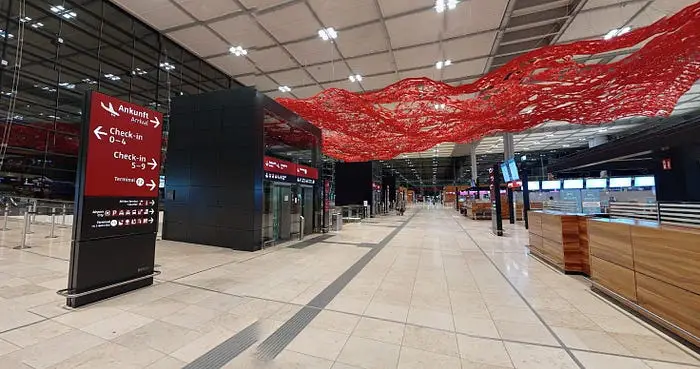
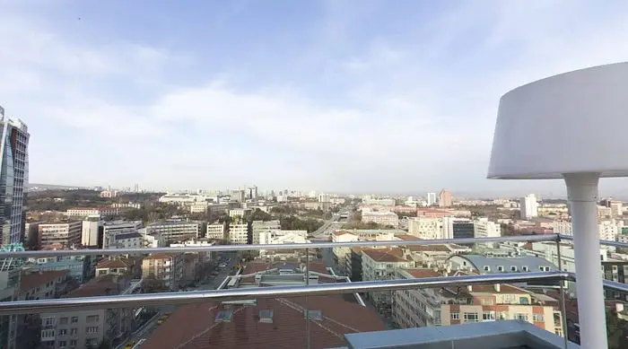
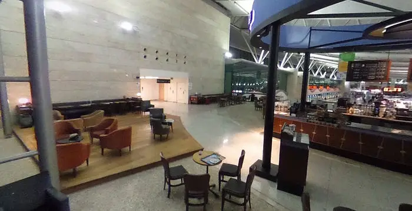
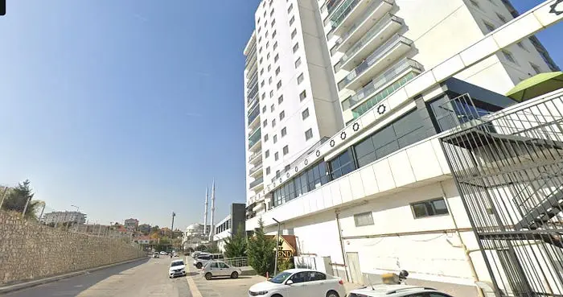

# 🕵️ Locating a Fugitive Using Fragmented POV Imagery

## 🎯 Objective

Identify the location of a target evading capture using only a series of fragmented, first-person perspective images recorded by a body-mounted camera.  
The challenge was to geolocate each scene and determine the subject’s current position.

This scenario comes from the hacktoria.com

---

## 📷 Source Material

- **5 images** showing different scenes:
  1. Interior with **German-language signs** and distinctive red decoration
  2. **City panorama** taken from a balcony
  3. **Hotel room interior**
  4. **Airport interior** with distinctive architectural elements
  5. **Building with Middle Eastern / Islamic architecture**

Some images contained German text, others showed Middle Eastern features, raising the possibility that the locations spanned more than one country.

---

## 🛠 Methodology

1. **Metadata Scan**

   - Tools: `exiftool`, Metadata2Go
   - All images stripped of location and device data
   - No EXIF geotags or timestamps recovered

2. **Visual Analysis & Reverse Image Search**

   - **image-01.png**
     - German language, red interior decoration → matched **Berlin Brandenburg Willy Brandt Airport**
   - **image-04.png**
     - Distinctive ceiling and layout → identified as **Ankara Esenboğa Airport**
     - This confirmed a likely shift in the target’s location to **Ankara, Turkey**
   - **image-05.png**
     - Islamic-style architecture in the background → matched **Ankara apartment building** at **40°04'04.8"N 32°55'45.8"E**
   - **image-03.png**
     - Hotel room interior → no unique identifying features
   - **image-02.png**
     - Balcony city view with tall building on the left → matched **Lantaya Hotel**, Ankara (+90 312 416 88 00) using Google Earth and comparative skyline analysis

3. **Cross-Referencing & Confirmation**
   - Combined architectural matches with Bellingcat OSM data
   - Verified street-level and aerial perspectives via Google Earth

---

## 📌 Results

- **Final Location:** **Lantaya Hotel**, Ankara, Turkey
- **Coordinates:** 39°54'47.4"N 32°51'28.7"E
- **Likely Movement Path:** Berlin Brandenburg Airport → Ankara Esenboğa Airport → Lantaya Hotel area

**Screenshots:**

- 
- 
- 
- 

---

## 🧠 Findings

- Even without metadata, cross-referencing partial architectural details and signage can reliably determine location.
- Identifying **transit hubs** (airports, train stations) early in analysis helps narrow down potential country and city.
- Skyline and balcony views are highly distinctive when matched with mapping tools.
- Using **multiple OSINT tools** in parallel speeds up confirmation of location.

---

## 🔗 Related Links

- [ExifTool](https://exiftool.org/)
- [Bellingcat’s Online Investigation Toolkit](https://bellingcat.gitbook.io/toolkit)
- [Google Earth](https://earth.google.com/)
- [Overpass Turbo](https://overpass-turbo.eu/)
