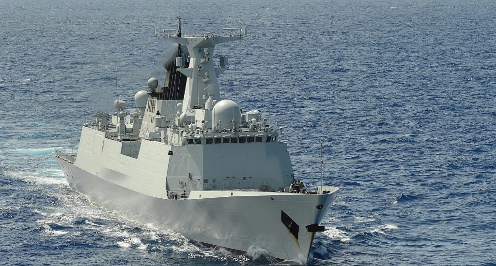

# 🚢 Warship Identification from Surveillance Image

## 🎯 Objective

Identify an unidentified warship approaching Taiwanese territorial waters based on photographic evidence using open-source intelligence methods.

This challenge comes from the hacktoria.com

---

## 📷 Source Material

A single photograph of an unidentified naval vessel, captured at approximately **09:43 Taiwan Standard Time (TST)**.  
No additional metadata or location information was initially provided.

---

## 🛠 Methodology

1. **Metadata Analysis**

   - Extracted metadata from the image using public tools
   - Found no useful embedded data (location, device, timestamps were missing or stripped)

2. **Reverse Image Search**

   - Conducted a reverse image search using Google Images
   - Compared structural features such as:
     - Hull design
     - Superstructure layout
     - Mast and radar configurations

3. **Class and Origin Identification**
   - Identified strong matches suggesting the ship belongs to the **Jiangkai II-class (Type 054A)** frigates
   - Verified class features against open-source images
   - Confirmed that the vessel belongs to the **People’s Liberation Army Navy (PLAN)** of China

---

## 📌 Results

- **Vessel Class:** Jiangkai II-class (Type 054A)
- **Affiliation:** People’s Liberation Army Navy (PLAN), China
- **Observed Time:** 09:43 Taiwan Standard Time (TST)
- **Location Context:** Approaching Taiwanese territorial waters

**Screenshots:**

- 

---

## 🧠 Findings

- Metadata stripping did not prevent successful identification thanks to visual OSINT techniques
- Structural analysis (especially masts, sensors, and superstructure) is critical in naval vessel identification
- Reverse image search remains a powerful initial tool for unknown military hardware analysis

---

## 🔗 Related Links

- [Type 054A Frigate – Wikipedia](https://en.wikipedia.org/wiki/Type_054A_frigate)
